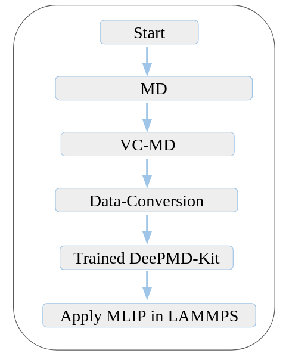

# From Quantum ESPRESSO to DeePMD-kit: A Workflow for Atomistic Modeling

Modern atomistic simulations often bridge first-principles accuracy with machine learning speed. This tutorial provides a complete workflow starting from Density Functional Theory (DFT) calculations using Quantum ESPRESSO, through training a deep neural network interatomic potential using DeePMD-kit, and finally to running large-scale Molecular Dynamics (MD) simulations with LAMMPS using the trained model.

We specifically focus on the example of CH₄, demonstrating:

- How to run DFT-based molecular dynamics (MD) and variable-cell MD (vc-MD) to sample high-quality atomic configurations.
- How to extract structural, energetic, force, and stress data from Quantum ESPRESSO outputs.
- How to convert that data into a format suitable for DeePMD-kit and train a robust potential.
- How to validate and apply the trained model in LAMMPS for large-scale simulations.

All steps are technical and practical, with minimal theory. This guide provides step-by-step instructions to convert Quantum ESPRESSO output files for use in DeePMD-kit training. All steps are technical; no theoretical background provided.

---

## Prerequisites

- A Linux system with Quantum Espresso Installed init
- Python environment (recommended)
- DeePMD-kit installed
- [QE-to-DeePMD converter script]([https://github.com/deepmodeling/deepmd-kit/tree/master/tools/convert/qe](https://github.com/didarul59/QE-relax_to_DeePMD.git)) (or your own script)

---
## 📚 Resources

- [Quantum ESPRESSO User Guide](https://www.quantum-espresso.org/Doc/pw_user_guide/)
- [Quantum ESPRESSO Input Generator](https://qeinputgenerator.materialscloud.io/)
- [Tutorial by Pranab Das](https://pranabdas.github.io/espresso/)
